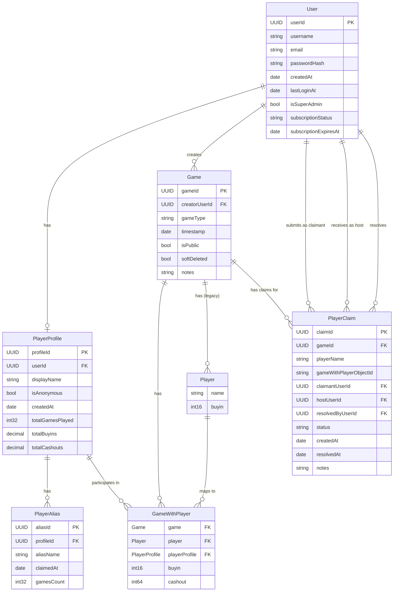
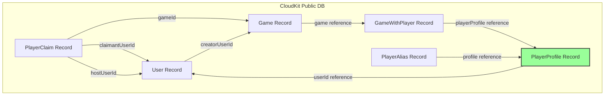
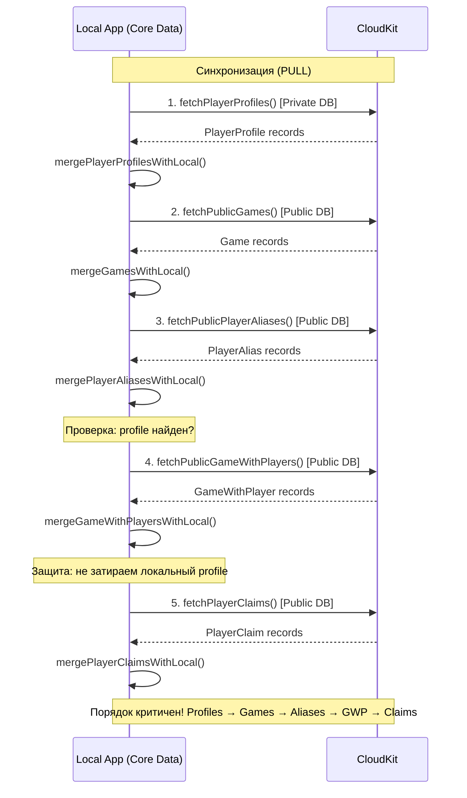
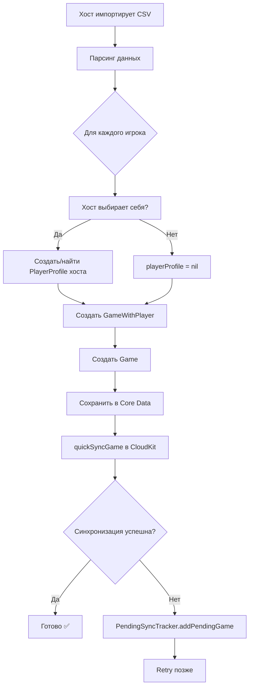
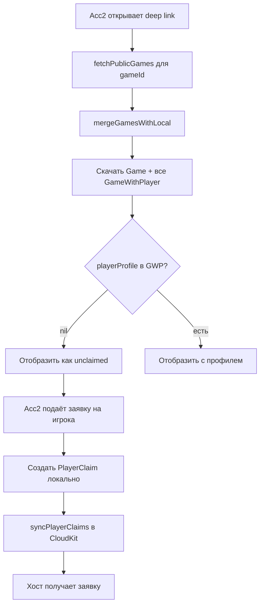
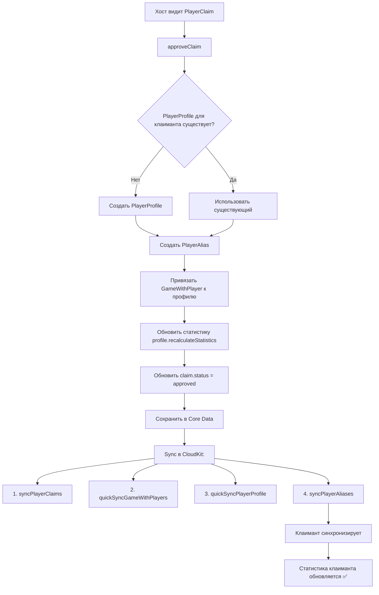
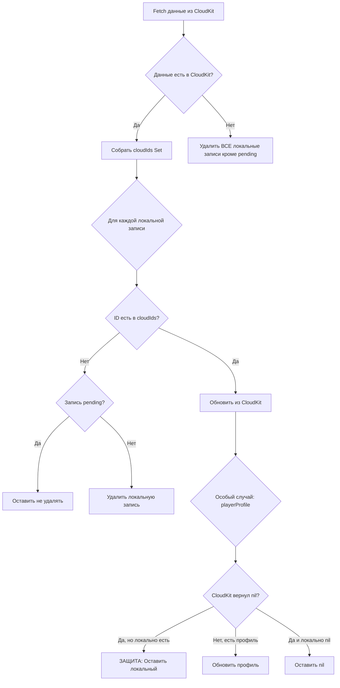
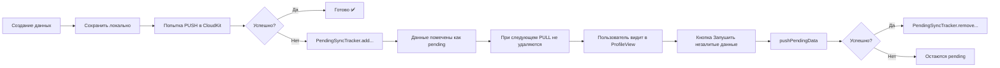
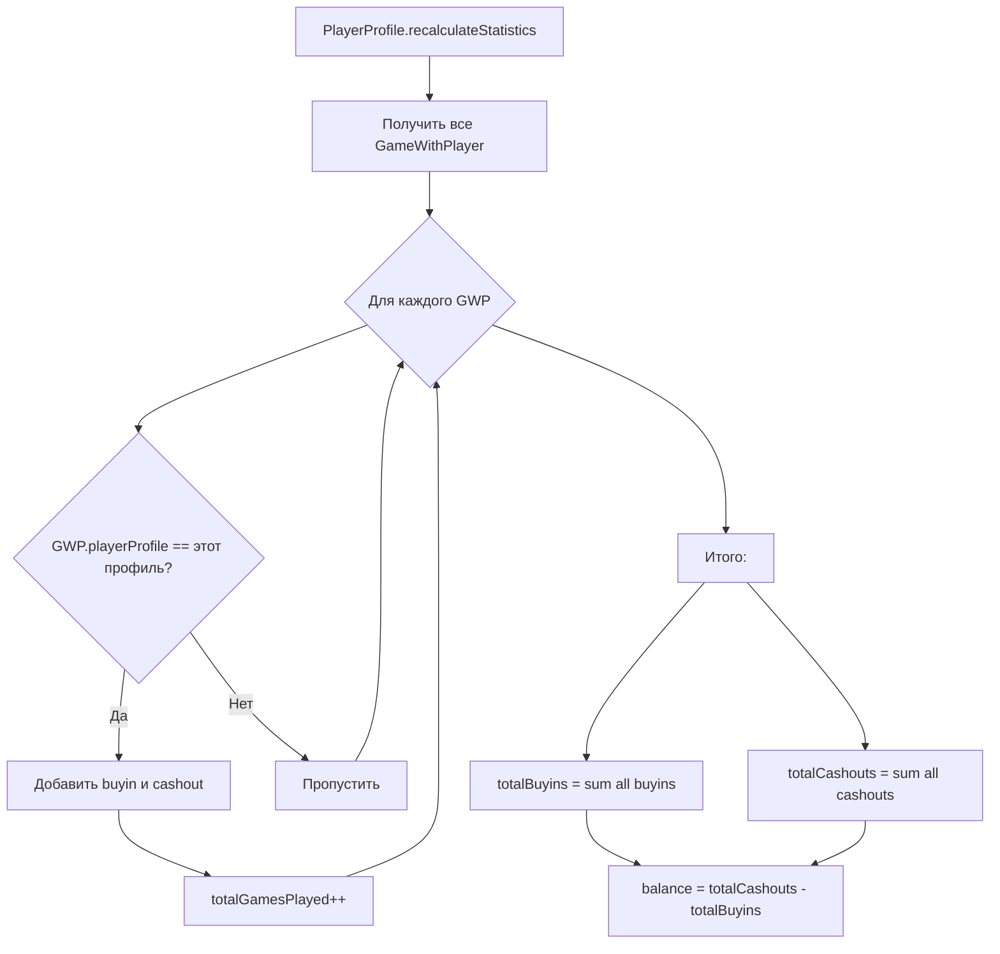

# Диаграмма данных - Fish & Chips (gamesCheck)

**Последнее обновление:** 2026-02-07

---

## 📊 Схема базы данных (Core Data)

### Основные сущности и их связи



---

## ☁️ CloudKit Database Schema

### Public Database (доступна всем пользователям)



### Какие данные в какой базе

| Entity | CloudKit Database | Почему |
|--------|------------------|--------|
| **User** | Public DB | Нужна проверка уникальности email при регистрации |
| **PlayerProfile** | Public DB | Нужна cross-user видимость для системы заявок и привязки GWP |
| **PlayerAlias** | Public DB | Нужна видимость для cross-user claims |
| **Game** | Public DB | Публичные игры, доступные по deep link |
| **GameWithPlayer** | Public DB | Нужна видимость игроков в играх |
| **PlayerClaim** | Public DB | Межпользовательские заявки |

---

## 🔄 Поток данных при синхронизации



---

## 🎯 Ключевые бизнес-процессы

### 1. Импорт игр хостом



### 2. Подача заявки (Deep Link)



### 3. Подтверждение заявки



---

## 🛡️ Защита данных (Source of Truth)

### CloudKit = Source of Truth

При синхронизации (PULL):



### Pending Data Tracker



---

## 📈 Расчёт статистики



**Важно:** Только `GameWithPlayer` с привязанным `playerProfile` учитываются в статистике!

---

## 🔑 Ключевые идентификаторы

| Entity | Primary Key | Используется для |
|--------|-------------|------------------|
| User | `userId` (UUID) | Привязка к профилю, авторизация |
| PlayerProfile | `profileId` (UUID) | Уникальный идентификатор профиля |
| PlayerAlias | `aliasId` (UUID) | Уникальный идентификатор алиаса |
| Game | `gameId` (UUID) | Deep links, синхронизация |
| GameWithPlayer | `(gameId, playerName)` | Composite key для поиска |
| PlayerClaim | `claimId` (UUID) | Уникальный идентификатор заявки |

### Stable Identifiers (не используем!)

❌ **НЕ использовать** `objectID` из Core Data - нестабильный после перезапуска
✅ **Использовать** `UUID` поля для стабильных ссылок

---

## 🔄 Relationships (Core Data)

### Inverse Relationships

```
User.playerProfile ←→ PlayerProfile.user
User.createdGames ←→ Game.creator

PlayerProfile.aliases ←→ PlayerAlias.profile
PlayerProfile.gameParticipations ←→ GameWithPlayer.playerProfile

Game.gameWithPlayers ←→ GameWithPlayer.game
Player.gameWithPlayers ←→ GameWithPlayer.player

Game.players ←→ Player.game (legacy, для обратной совместимости)
```

### Deletion Rules

| Relationship | Deletion Rule | Причина |
|-------------|---------------|---------|
| `PlayerProfile.aliases` | Cascade | При удалении профиля удаляются все алиасы |
| `PlayerProfile.gameParticipations` | Nullify | При удалении профиля GWP остаются, но без профиля |
| `Game.gameWithPlayers` | Nullify | При удалении игры GWP не удаляются (мягкое удаление) |
| `User.playerProfile` | Nullify | При удалении юзера профиль остаётся |

---

## 🎨 Цветовая легенда (для диаграмм)

- 🟦 **Core Data** - локальное хранилище
- 🟪 **CloudKit Private DB** - приватные данные пользователя
- 🟩 **CloudKit Public DB** - публичные/shared данные
- 🟨 **Pending** - данные ожидают синхронизации
- 🟥 **Защита** - критичная логика, не затирать

---

## 📝 Примечания

### Почему PlayerProfile в Public DB?

- Нужна cross-user видимость для системы заявок
- Когда хост подтверждает заявку, создаётся профиль для клаиманта
- GameWithPlayer ссылается на профиль через CKRecord.Reference
- Клаимант должен увидеть свой профиль и статистику после синхронизации
- Статистика считается по GameWithPlayer, привязанным к профилю

**ВАЖНО:** Раньше был в Private DB, но это блокировало cross-user функциональность!

### Почему PlayerAlias в Public DB?

- Нужна видимость для системы заявок
- Хост должен видеть алиасы клаиманта
- Позволяет подтверждать заявки cross-user

### Порядок синхронизации критичен!

1. **PlayerProfile** - должны быть скачаны первыми
2. **Game** - основа для всех связей
3. **PlayerAlias** - требуют наличия профилей
4. **GameWithPlayer** - требуют наличия игр и профилей
5. **PlayerClaim** - требуют наличия игр и юзеров

Если скачать в неправильном порядке → ошибки валидации Core Data!

---

**Версия:** 1.1  
**Дата:** 2026-02-07 23:00  
**Изменения:**
- v1.1 (2026-02-07 23:00): PlayerProfile мигрирован из Private DB в Public DB для cross-user видимости
- v1.0 (2026-02-07 19:15): Первая версия диаграммы

**Автор:** AI Agent (Claude Sonnet 4.5)
