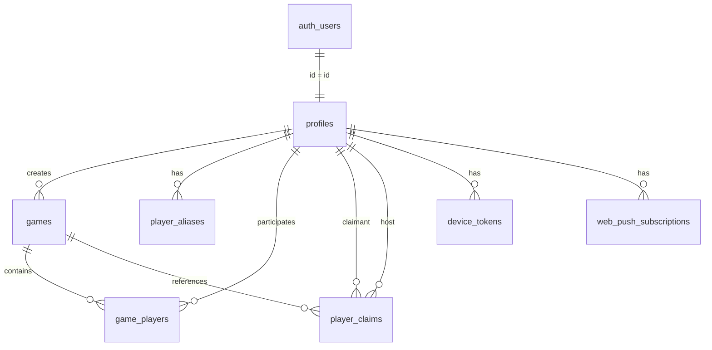
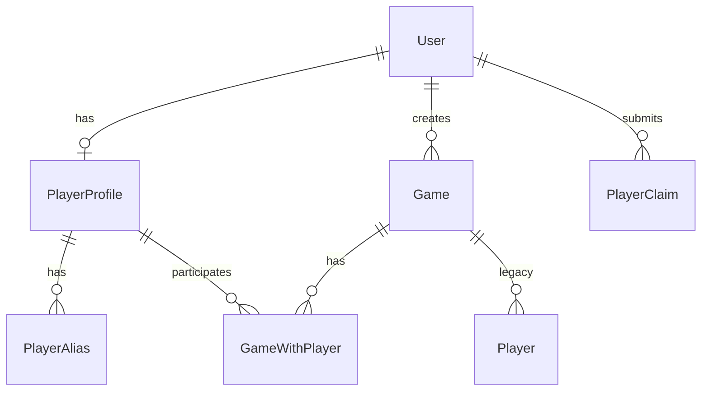
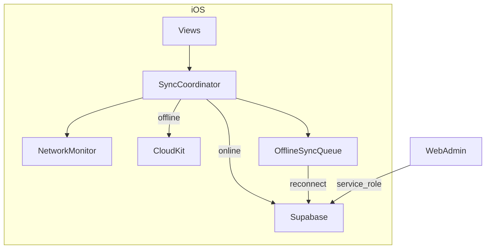

# Диаграмма данных — Fish & Chips

**Обновление:** 2026-04-21 | v4.8 — iOS: `ChipValue.tengePerChip` (= `buyin_to_tenge_units()` / 2000) в `Models/ChipValue.swift`; клиентский профит/баланс согласован с DTO (`GamePlayerDTO.profit`, `ProfileDTO.balance`). Deep link / share: базовый URL веб-SPA — `WEB_APP_BASE_URL` (Info.plist), путь игры `/app/games/:id`.

**Обновление:** 2026-04-16 | v4.7 — миграция **019** `remove_billiard`: таблица `billiard_batches` удалена; исторические игры с типом бильярд в `games.game_type` приведены к `Poker`. Только покер.

**Обновление:** 2026-03-29 | v4.6 — миграция **017** `buyin_tenge_balance`: в БД и iOS **buyin** = чипы, **cashout** = ₸; баланс/профит в тенге = `cashout − buyin×2000`. Обновлены VIEW `user_statistics`, `admin_users_overview`, `admin_player_stats`; RPC `check_game_balance`, `get_player_sessions`, `get_player_mvp_count`, `admin_dashboard_stats`; хелпер `buyin_to_tenge_units()` = 2000.

**Обновление:** 2026-03-28 | v4.5 — VIEW `admin_player_stats` + RPC `get_player_sessions` / `get_player_mvp_count` (миграция 016): агрегаты веб-админки по `LOWER(TRIM(player_name))`, не по `profiles`

---

## Supabase PostgreSQL Schema

```mermaid
erDiagram
    auth_users ||--|| profiles : "id = id"
    profiles ||--o{ games : creates
    profiles ||--o{ player_aliases : has
    profiles ||--o{ game_players : participates
    games ||--o{ game_players : contains
    profiles ||--o{ player_claims : "claimant"
    profiles ||--o{ player_claims : "host"
    games ||--o{ player_claims : references
    profiles ||--o{ device_tokens : has
    profiles ||--o{ web_push_subscriptions : has
```

**Ключи:** profiles.id (= auth.users.id) | games.id | player_aliases.id | player_claims.id
**Все UUID**, автогенерация через `gen_random_uuid()`.

---

## Таблицы

| Таблица | Назначение | RLS |
|---------|-----------|-----|
| profiles | User + PlayerProfile (объединены) | Публичные видны всем, свой — всегда |
| games | Игры | Публичные видны всем, CRUD — только creator |
| game_players | Участники игр (ex GameWithPlayer) | Видны если видна игра |
| player_aliases | Алиасы игроков | Видны если профиль публичный |
| player_claims | Заявки на привязку | Видны claimant и host |
| device_tokens | APNs токены устройств (iOS) | Только свои |
| web_push_subscriptions | Web Push (endpoint, p256dh, auth) | Только свои |
| rate_limits | Учёт вызовов для rate limit (Edge Functions) | RLS, без публичного доступа |
| poker_hands | Раздачи покера для веба: `board_cards` + `players` (JSONB: `player_name`, `hole_cards`, `win_percentage`); опционально `recognition_source` (`manual` / `gemini` / `vision-ocr`), `recognition_corrections` (JSONB) | RLS 006/011 + insert для `is_super_admin` (014) |

### Storage (Supabase)

| Bucket | Назначение | RLS |
|--------|------------|-----|
| `card-photos` | Фото столов для Card Vision (до 5 MB, jpeg/png/webp) | Загрузка/чтение/удаление только в префиксе `{user_id}/` (миграция 013) |

---

## Views (PostgreSQL, серверные)

| View | Что считает | Примечание |
|------|-------------|------------|
| game_summaries | total_players, total_buyins, checksum | Обычный VIEW (миграция 010), данные актуальны без REFRESH |
| user_statistics | balance, win_rate, avg_profit | Обычный VIEW (010); **015** — без soft-deleted игр; **017** — баланс и win_rate через **buyin×2000** (чипы → ₸), как iOS |
| admin_users_overview | balance из `profiles` | **017**: `total_cashouts − total_buyins×2000` |
| admin_player_stats | Агрегаты по каноническому имени (`LOWER(TRIM(player_name))`), `games_by_type` JSONB, `linked_profile_id` | VIEW **016**; **017** — те же правила ₸ для balance / profit-метрик |

Заменяют Core Data entity: GameSummaryRecord, UserStatisticsSummary, UserGameIndex.

---

## Triggers

| Trigger | Таблица | Что делает |
|---------|---------|-----------|
| set_*_updated_at | profiles, games | Автообновление updated_at |
| update_profile_stats | game_players | Пересчёт total_games_played, total_buyins, total_cashouts |
| on_auth_user_created | auth.users | Автосоздание профиля при регистрации |

---

## Database Functions

| Функция | Назначение |
|---------|-----------|
| get_game_checksums(user_id) | Серверные checksums для smart sync |
| update_updated_at() | Trigger helper |
| recalculate_profile_stats() | Trigger helper |
| handle_new_user() | Trigger: создание профиля |
| upsert_with_conflict(table, id, data, client_updated_at) | Server-wins conflict resolution для offline queue replay |
| check_conflicts(table, items) | Batch: возвращает UUID[] строк, где сервер новее клиента |
| check_rate_limit(user_id, action, max/min, max/hour) | Rate limit для Edge (`SECURITY DEFINER`, service_role) |
| get_player_sessions(player_key) | Сессии по имени; **017** — `profit` = cashout − buyin×2000 |
| get_player_mvp_count(player_key) | MVP по профиту в ₸ (017) |
| buyin_to_tenge_units() | Константа 2000 для SQL (017) |
| check_game_balance(game_id) | **017**: сходимость стола `SUM(cashout) = SUM(buyin)×2000` |

---

## Core Data ER (локальный кэш)

```mermaid
erDiagram
    User ||--o| PlayerProfile : has
    User ||--o{ Game : creates
    PlayerProfile ||--o{ PlayerAlias : has
    PlayerProfile ||--o{ GameWithPlayer : participates
    Game ||--o{ GameWithPlayer : has
    Game ||--o{ Player : "legacy"
    User ||--o{ PlayerClaim : submits
```

Core Data остаётся как **локальный кэш**. Supabase = Source of Truth.

---

## Синхронизация (Hybrid Architecture)

```mermaid
graph TB
    subgraph iOS
        Views --> SyncCoordinator
        SyncCoordinator --> NetworkMonitor
        SyncCoordinator -->|online| Supabase
        SyncCoordinator -->|offline| CloudKit
        SyncCoordinator --> OfflineSyncQueue
        OfflineSyncQueue -->|reconnect| Supabase
    end
    WebAdmin -->|service_role| Supabase
```

**Online:** Write → Supabase (primary) + CloudKit (fire-and-forget mirror). Web admin видит данные сразу.

**Offline:** Write → Core Data + CloudKit. Операции → OfflineSyncQueue. При reconnect → replay queue + pull.

**Smart Sync:** performMinimalSync (profile + 20 games + pending claims) → checkServerChecksums → при расхождении performBackgroundSync.

**Инкрементальная:** fetchSince(updated_at > lastSyncDate) — загружаются только изменённые.

**Push:** upsert через REST API. Batch для game_players, aliases, claims.

**Conflict resolution:** Server wins. `upsert_with_conflict()` на стороне PostgreSQL сравнивает `updated_at`.

---

## Защита данных

- Supabase = Source of Truth: при pull сервер перезаписывает локальное
- PendingSyncTracker — не удалять при pull данные, ещё не отправленные на сервер
- RLS — безопасность на уровне базы (creator видит свои, public видны всем)
- ON DELETE CASCADE — удаление game удаляет game_players, claims
- CHECK constraint на player_claims.status — только 'pending', 'approved', 'rejected'

---

## Миграция CloudKit → Supabase

| CloudKit Entity | Supabase Table | Примечание |
|----------------|---------------|-----------|
| User + PlayerProfile | profiles | Объединены в одну таблицу |
| Game | games | 1:1 |
| GameWithPlayer | game_players | Переименован |
| PlayerAlias | player_aliases | 1:1 |
| PlayerClaim | player_claims | References по UUID |
| GameSummaryRecord | game_summaries (mat. view) | Серверная, не таблица |
| UserStatisticsSummary | user_statistics (mat. view) | Серверная, не таблица |
| UserGameIndex | user_statistics (mat. view) | Вошёл в user_statistics |
| AppNotification | -- | Остаётся только в Core Data |

---

## SQL Миграции (отдельный репозиторий: `../fishchips-supabase/`)

| Файл | Содержание |
|------|-----------|
| `migrations/001_initial_schema.sql` | CREATE TABLE, индексы, RLS-политики, triggers, materialized views, functions |
| `migrations/002_improvements.sql` | GDPR deletion, server-side validation, webhooks |
| `migrations/003_admin_views.sql` | Admin views, dashboard RPC functions |
| `migrations/004_conflict_resolution.sql` | `upsert_with_conflict()`, `check_conflicts()` для гибридной архитектуры |
