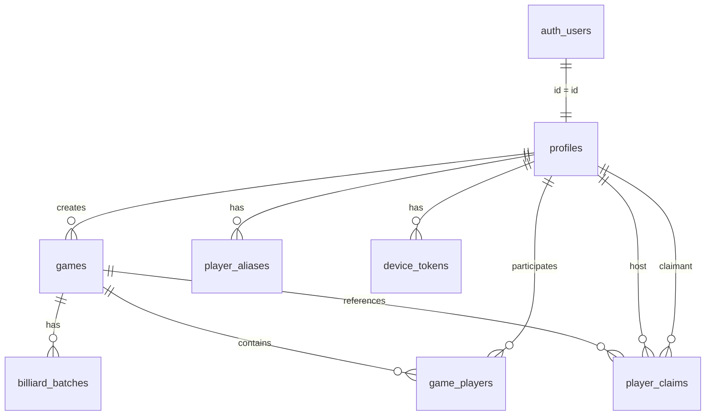
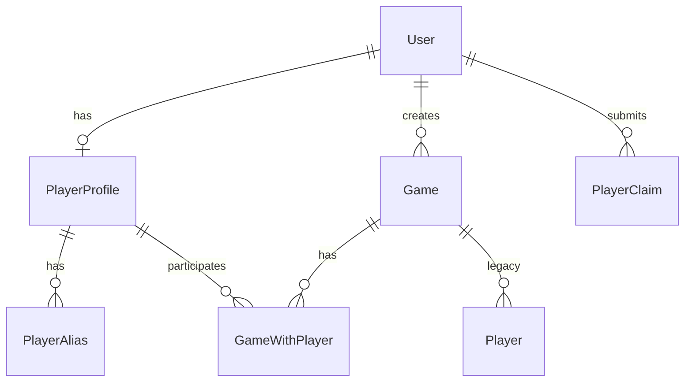

# Диаграмма данных — Fish & Chips

**Обновление:** 2026-03-18 | v3.0 (Supabase Migration)

---

## Supabase PostgreSQL Schema

```mermaid
erDiagram
    auth_users ||--|| profiles : "id = id"
    profiles ||--o{ games : creates
    profiles ||--o{ player_aliases : has
    profiles ||--o{ game_players : participates
    games ||--o{ game_players : contains
    games ||--o{ billiard_batches : has
    profiles ||--o{ player_claims : "claimant"
    profiles ||--o{ player_claims : "host"
    games ||--o{ player_claims : references
    profiles ||--o{ device_tokens : has
```

**Ключи:** profiles.id (= auth.users.id) | games.id | player_aliases.id | player_claims.id
**Все UUID**, автогенерация через `gen_random_uuid()`.

---

## Таблицы

| Таблица | Назначение | RLS |
|---------|-----------|-----|
| profiles | User + PlayerProfile (объединены) | Публичные видны всем, свой — всегда |
| games | Игры | Публичные видны всем, CRUD — только creator |
| game_players | Участники игр (ex GameWithPlayer) | Видны если видна игра |
| player_aliases | Алиасы игроков | Видны если профиль публичный |
| player_claims | Заявки на привязку | Видны claimant и host |
| billiard_batches | Партии бильярда | Видны если видна игра |
| device_tokens | APNs токены устройств | Только свои |

---

## Materialized Views (PostgreSQL, серверные)

| View | Что считает | Обновление |
|------|-------------|------------|
| game_summaries | total_players, total_buyins, checksum | `REFRESH MATERIALIZED VIEW` |
| user_statistics | balance, win_rate, avg_profit | `REFRESH MATERIALIZED VIEW` |

Заменяют Core Data entity: GameSummaryRecord, UserStatisticsSummary, UserGameIndex.

---

## Triggers

| Trigger | Таблица | Что делает |
|---------|---------|-----------|
| set_*_updated_at | profiles, games | Автообновление updated_at |
| update_profile_stats | game_players | Пересчёт total_games_played, total_buyins, total_cashouts |
| on_auth_user_created | auth.users | Автосоздание профиля при регистрации |

---

## Database Functions

| Функция | Назначение |
|---------|-----------|
| get_game_checksums(user_id) | Серверные checksums для smart sync |
| update_updated_at() | Trigger helper |
| recalculate_profile_stats() | Trigger helper |
| handle_new_user() | Trigger: создание профиля |

---

## Core Data ER (локальный кэш)

```mermaid
erDiagram
    User ||--o| PlayerProfile : has
    User ||--o{ Game : creates
    PlayerProfile ||--o{ PlayerAlias : has
    PlayerProfile ||--o{ GameWithPlayer : participates
    Game ||--o{ GameWithPlayer : has
    Game ||--o{ Player : "legacy"
    User ||--o{ PlayerClaim : submits
```

Core Data остаётся как **локальный кэш**. Supabase = Source of Truth.

---

## Синхронизация

**Smart Sync:** performMinimalSync (profile + 20 games + pending claims) → checkServerChecksums → при расхождении performBackgroundSync.

**Инкрементальная:** fetchSince(updated_at > lastSyncDate) — загружаются только изменённые.

**Push:** upsert через REST API. Batch для game_players, aliases, claims.

---

## Защита данных

- Supabase = Source of Truth: при pull сервер перезаписывает локальное
- PendingSyncTracker — не удалять при pull данные, ещё не отправленные на сервер
- RLS — безопасность на уровне базы (creator видит свои, public видны всем)
- ON DELETE CASCADE — удаление game удаляет game_players, claims, billiard_batches
- CHECK constraint на player_claims.status — только 'pending', 'approved', 'rejected'

---

## Миграция CloudKit → Supabase

| CloudKit Entity | Supabase Table | Примечание |
|----------------|---------------|-----------|
| User + PlayerProfile | profiles | Объединены в одну таблицу |
| Game | games | 1:1 |
| GameWithPlayer | game_players | Переименован |
| PlayerAlias | player_aliases | 1:1 |
| PlayerClaim | player_claims | References по UUID |
| BilliardBatche | billiard_batches | 1:1 |
| GameSummaryRecord | game_summaries (mat. view) | Серверная, не таблица |
| UserStatisticsSummary | user_statistics (mat. view) | Серверная, не таблица |
| UserGameIndex | user_statistics (mat. view) | Вошёл в user_statistics |
| AppNotification | -- | Остаётся только в Core Data |

---

## SQL Миграция

Файл: `supabase/migrations/001_initial_schema.sql`

Включает: CREATE TABLE, индексы, RLS-политики, triggers, materialized views, functions.
